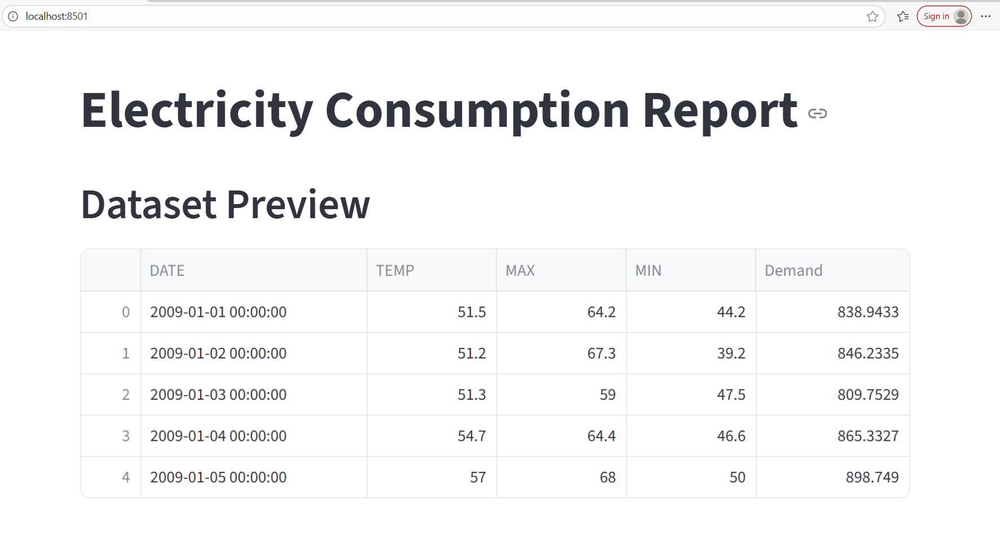
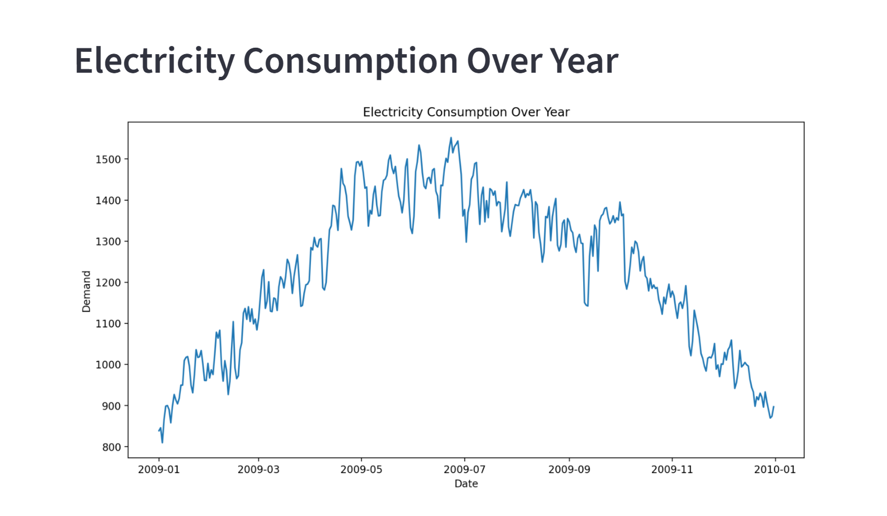
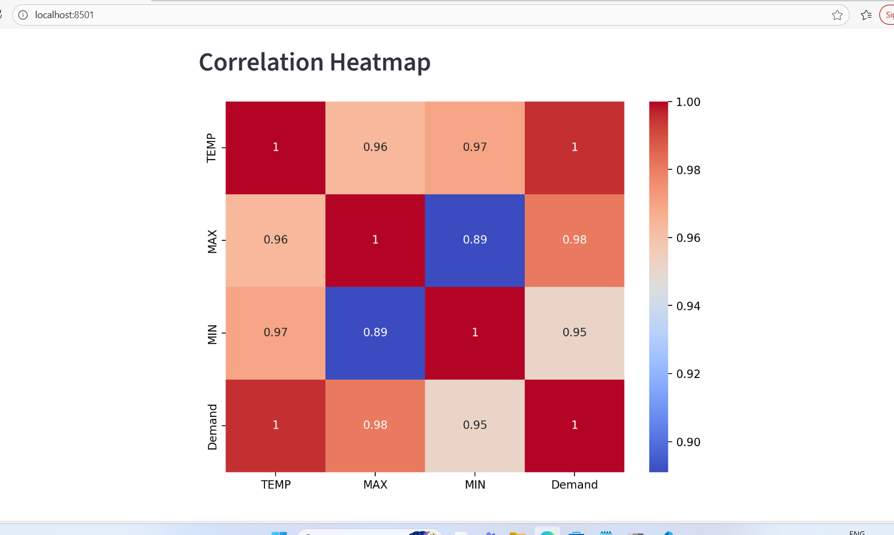
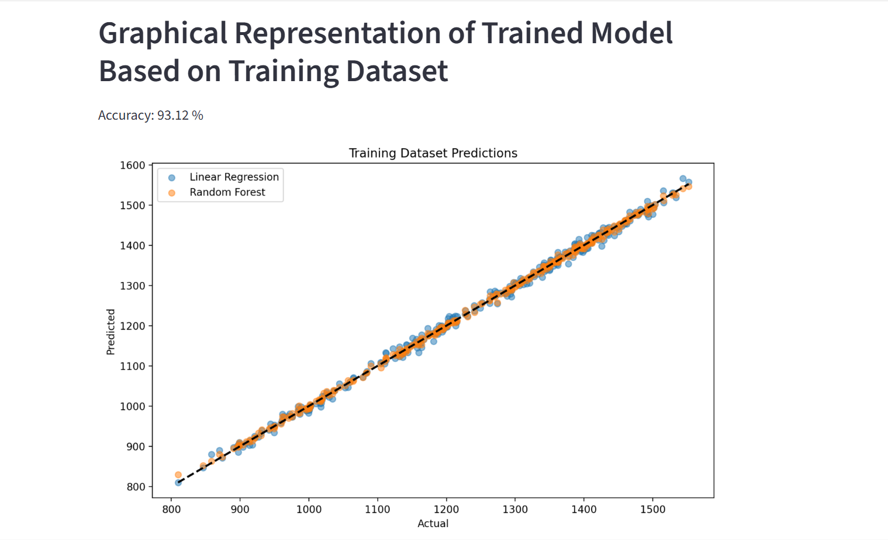
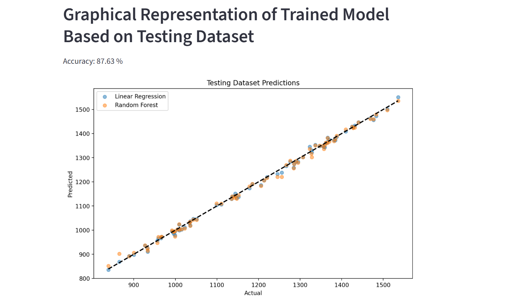
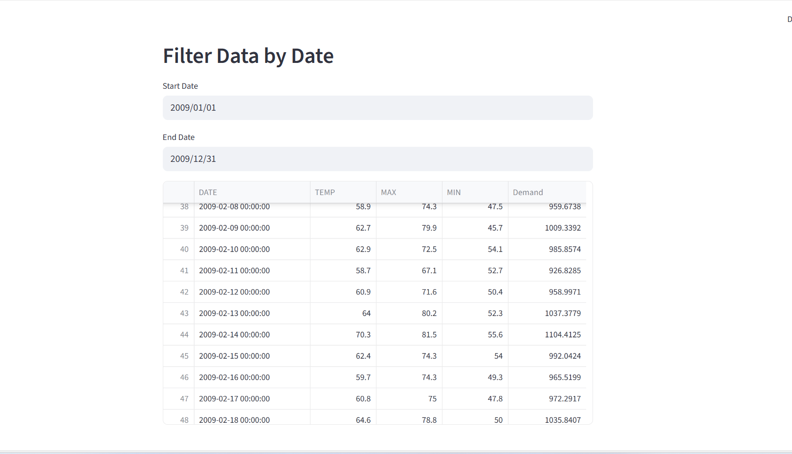
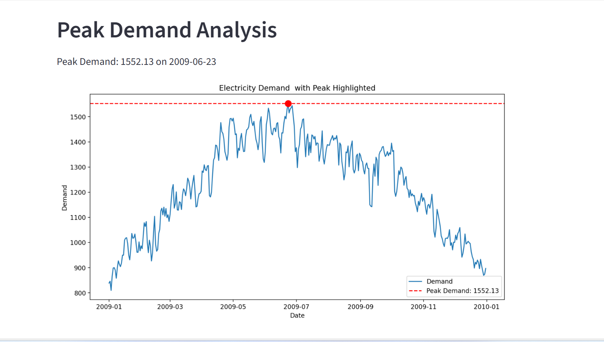
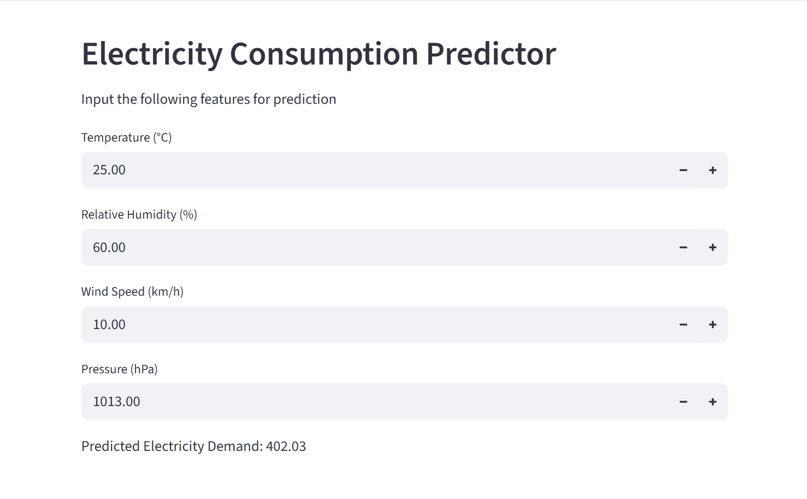

#  Electricity Demand Forecasting and Peak Demand Prediction

An AI-based Electricity Demand Forecasting System developed to predict electricity consumption and peak demand using Machine Learning techniques. The project analyzes historical electricity demand and weather-related data to improve forecasting accuracy and support power system planning.

##  Features

- Electricity Demand Forecasting
- Peak Demand Analysis
- Machine Learning-Based Prediction
- Correlation Analysis using Heatmaps
- Interactive Data Filtering
- Data Visualization Dashboard
- Demand Prediction using Weather Parameters

##  Technologies Used

- Python
- Pandas
- NumPy
- Matplotlib
- Scikit-Learn
- Prophet
- TensorFlow (LSTM)
- Streamlit

##  Machine Learning Models

- Linear Regression
- Random Forest Regressor
- Prophet
- LSTM Neural Network

##  Project Structure

```bash
electricity-demand-forecasting/
│
├── models/
├── delhi_demand.csv
├── electricity_demand_model.ipynb
├── report_app.py
├── requirements.txt
├── README.md
└── images/
```

##  Objectives

- Forecast future electricity demand.
- Predict peak power demand.
- Analyze the impact of weather conditions on electricity consumption.
- Assist power system operators in planning and decision-making.
- Improve demand management and grid reliability.

##  Installation

1. Clone the repository
```bash
git clone https://github.com/yourusername/electricity-demand-forecasting.git
```
2. Navigate to the project directory
```bash
cd electricity-demand-forecasting
```
3. Install required packages
```bash
pip install -r requirements.txt
```
4. Run the Streamlit application
```bash
streamlit run report_app.py
```

##  Results

### Dataset Preview


### Electricity Consumption Over Time


### Correlation Heatmap


### Training Dataset Results


### Testing Dataset Results


### Date-wise Data Filtering


### Peak Demand Analysis


### Demand Prediction Dashboard


## Key Outcomes

- Achieved accurate electricity demand forecasting using Machine Learning models.
- Identified peak demand periods for efficient power system planning.
- Visualized demand trends and weather relationships.
- Developed an interactive dashboard for demand analysis and prediction.

##  Author

**Saniya Shirin**  

## 📄 License

This project is developed for educational, research, and learning purposes.
