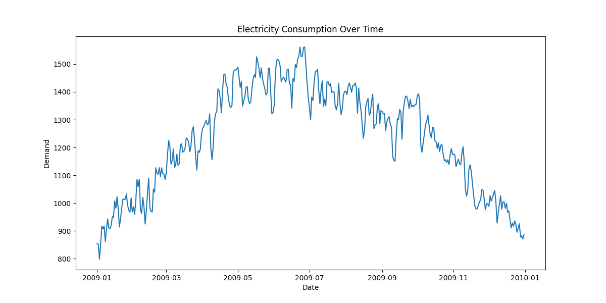
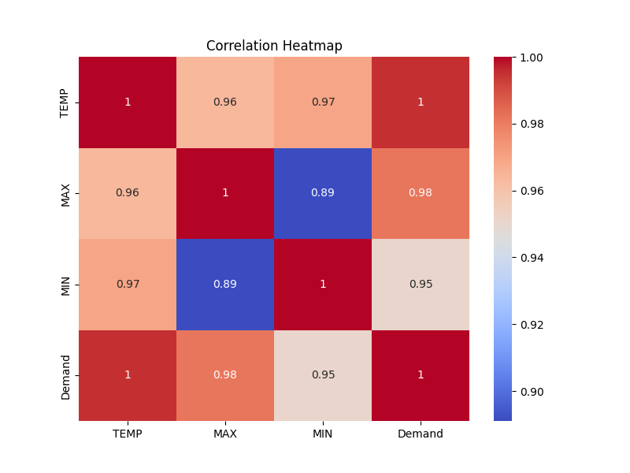

#  Electricity Demand Report

## Dataset Preview

|    | DATE                |   TEMP |   MAX |   MIN |   Demand |
|---:|:--------------------|-------:|------:|------:|---------:|
|  0 | 2009-01-01 00:00:00 |   51.5 |  64.2 |  44.2 |  814.192 |
|  1 | 2009-01-02 00:00:00 |   51.2 |  67.3 |  39.2 |  858.314 |
|  2 | 2009-01-03 00:00:00 |   51.3 |  59   |  47.5 |  800.226 |
|  3 | 2009-01-04 00:00:00 |   54.7 |  64.4 |  46.6 |  869.635 |
|  4 | 2009-01-05 00:00:00 |   57   |  68   |  50   |  923.367 |

## Electricity Consumption Over Time

## Correlation Heatmap

|        |     TEMP |      MAX |      MIN |   Demand |
|:-------|---------:|---------:|---------:|---------:|
| TEMP   | 1        | 0.963489 | 0.969382 | 0.995039 |
| MAX    | 0.963489 | 1        | 0.891041 | 0.981311 |
| MIN    | 0.969382 | 0.891041 | 1        | 0.952273 |
| Demand | 0.995039 | 0.981311 | 0.952273 | 1        |

## Filter Data by Date

Filtered data for a sample date range (e.g., 2009-01-01 to 2009-01-10):

|    | DATE                |   TEMP |   MAX |   MIN |   Demand |
|---:|:--------------------|-------:|------:|------:|---------:|
|  0 | 2009-01-01 00:00:00 |   51.5 |  64.2 |  44.2 |  814.192 |
|  1 | 2009-01-02 00:00:00 |   51.2 |  67.3 |  39.2 |  858.314 |
|  2 | 2009-01-03 00:00:00 |   51.3 |  59   |  47.5 |  800.226 |
|  3 | 2009-01-04 00:00:00 |   54.7 |  64.4 |  46.6 |  869.635 |
|  4 | 2009-01-05 00:00:00 |   57   |  68   |  50   |  923.367 |
|  5 | 2009-01-06 00:00:00 |   55.7 |  68.4 |  47.1 |  903.367 |
|  6 | 2009-01-07 00:00:00 |   54.5 |  70.9 |  42.6 |  903.367 |
|  7 | 2009-01-08 00:00:00 |   52.8 |  70.9 |  40.1 |  903.367 |
|  8 | 2009-01-09 00:00:00 |   56.1 |  68.4 |  42.8 |  903.367 |
|  9 | 2009-01-10 00:00:00 |   58.5 |  70.3 |  50.9 |  903.367 |

## Graphical Representation of Trained Model Based on Training Dataset

Accuracy: 93.12 %

## Graphical Representation of Trained Model Based on Testing Dataset

Accuracy: 87.63 %

##  Electricity Consumption Predictor

Input the following features for prediction:

- Temperature (°C): [Input field]
- Relative Humidity (%): [Input field]
- Wind Speed (km/h): [Input field]
- Pressure (hPa): [Input field]

Predicted Demand: [Prediction output]
